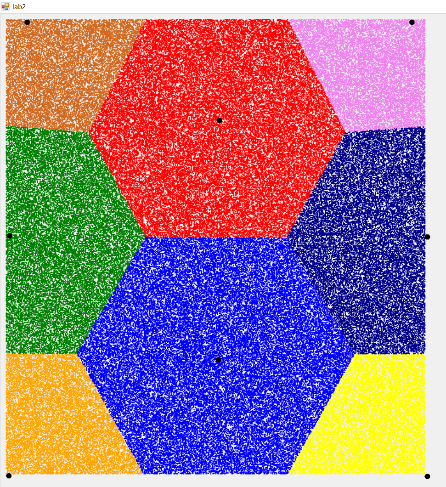

# Tasks
tasks of "Taking Decisions Methods and Algorithms" discipline of BSUIR 

## Task 1
implement and demonstrate Kmean algorithm of recognition objects with supervised learning 

## Task 2
implement and demonstrate Minmax algorithm of recognition objects with unsupervised learning 

